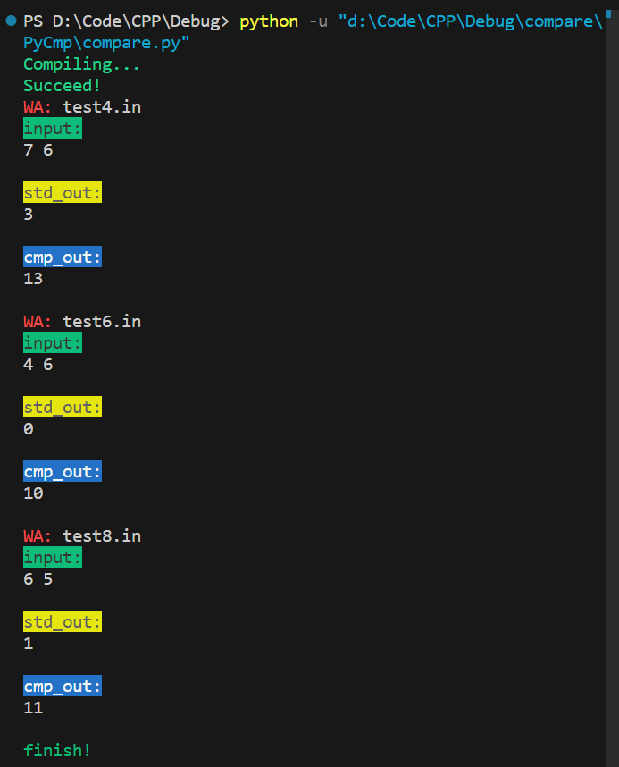
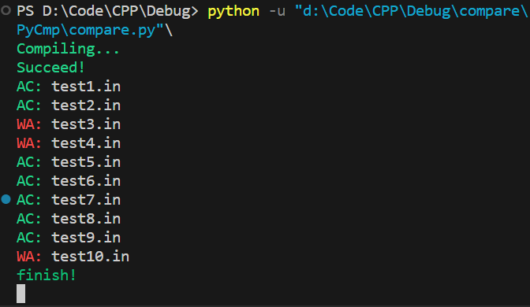

# program-compare

This is a program-comparer for programming competition. It's base on `cyaron`, but some simple encapsulation was made.

## Usage

1. Copy `ProgramCompare.py` to you workspace
2. New a python file and write `from ProgramCompare import *`
3. New a `ProgramCompare` class and appoint the `std_cpp` path and the `cmp_cpp` path.
4. Write the `setData` methods, it is a function object for making data according to the problem.

There are 6 methods in this class.

* `osCompare` means using `os.popen()` to get the output from two exe files and comparing the text of two.



* If you only want to gain `test.in` and `test.out` as data from `std_exe`, you can use `makeData`.
  
```python
######## make data
compare.makeData(1e1)
compare.makeData(1e2)
compare.makeData(1e3)
compare.makeData(1e4)
compare.makeData(1e5)
```

* `pyCompare` is similar as `osCompare`, but it use senior comparator. For example, it can ignore some space ` ` ,tab `	` and line feed `\n`.



* If there is a boundary, an error will occur when the data is greater than it, and no error will occur when it is not greater than it. You can use `lower_bound` to find this boundary


* If you want to make many tests at a time, try `run`.

* Finally, to clear the temporary file, `clear`!
